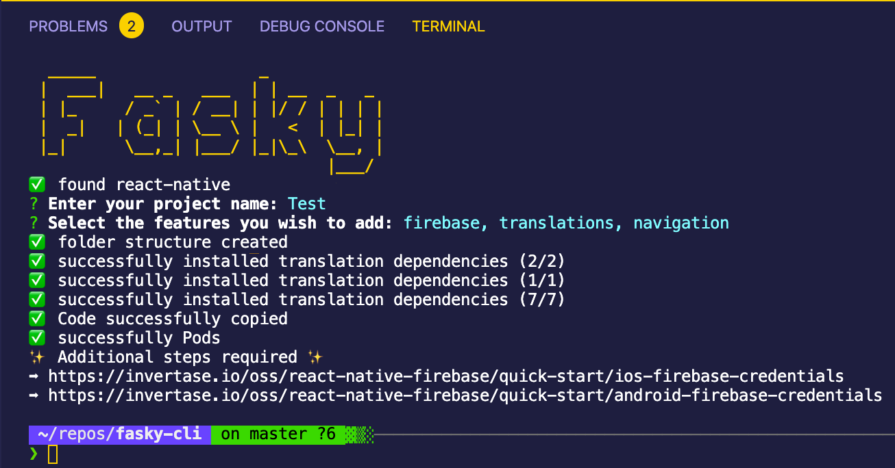

<h1 align="center"> React Native Base Template </h1>

    
    
    

    

  <strong>Basic React Native Project with some useful components</strong> 

## Table of Contents 📚

- [Installation 🔧](#introduction)
- [Usage 💡](#usage)
- [Tech 🏷](#tech)
- [Development 💻](#development)
- [Contributors 🤓](#Contributors-)

## Usage 💡

The <a href="https://www.npmjs.com/package/fasky-cli">fasky-cli</a> helps you to set up a best practice react native project within seconds. The cli is based on this project.

## Tech 🏷

- React Native 0.61.5
- i18N
- react-navigation v5

## Development 💻

- Install dependencies `npm install`
- Compile iOS `npx react-native run-ios`
- Compile Android `npx react-native run-android`

## Contributors 🤓

|  |  |
| ---------------------------------------------------------------------------------------------------------------------------------------------------------------------------------- | -------------------------------------------------------------------------------------------------------------------------------------- |
| 
[Max Haider](https://github.com/MaxHaider) 
                                                                                                                  | 
[Thomas Leiter](https://github.com/tomLadder) 
                                                                   | 
[Stefan Papst](https://github.com/sutefan1) 
 |
